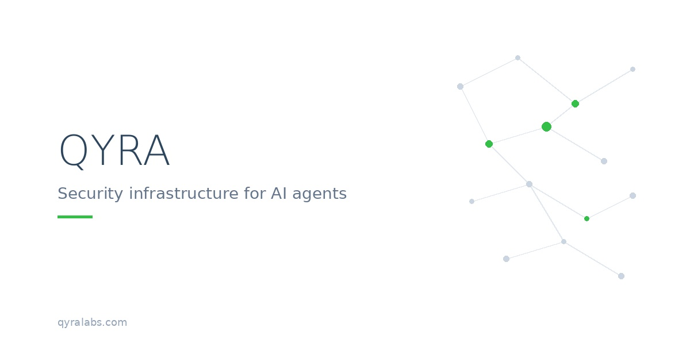

# MCP Security Overview

> 🎬 **[Watch the Dashboard Demo](https://youtu.be/rflKT2J4Inw)** 
---
This repository provides a high-level overview of security considerations,
architecture principles, and design intent for MCP and LLM-based systems.

It is intentionally non-executable and does not contain production code,
algorithms, or implementation details.

---

## Documentation

-  **[Threat Model](docs/threat-model.md)** - Attack surfaces and threat vectors for AI agents
-  **[Architecture Principles](docs/architecture-principles.md)** - Design principles and patterns from production

---

## Purpose

The purpose of this repository is to explain:
- Why security for LLM and agent systems requires dedicated infrastructure
- How deterministic controls and probabilistic analysis can coexist
- Where common failure modes appear in real-world deployments
- What design principles guide secure MCP integration

This is not a reference implementation.

---

## What This Is Not

This repository does **not** include:
- Production code
- Detection logic or heuristics
- Scoring models or thresholds
- Prompting strategies
- Tool-routing implementations
- Internal system details

Any resemblance to a complete system is intentional only at a conceptual level.

---

## Audience

This material is intended for:
- Engineers working with MCP, LLMs, or agent-based systems
- Security practitioners evaluating AI integration risks
- Technical decision-makers seeking architectural clarity

It is not designed as a tutorial or SDK.

---

## Status

This document reflects ongoing work.
Details may evolve as real-world constraints and learnings emerge.

---

## Learn More

- Website: [qyralabs.com](https://qyralabs.com)
- Contact: contact@qyralabs.com
